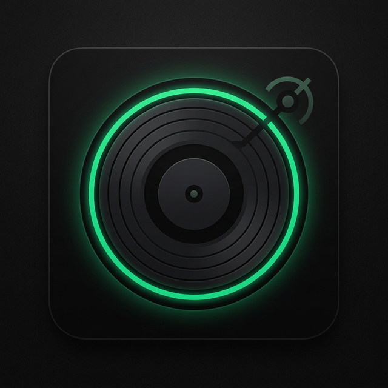

# good.dj


## **A browser-native DJ instrument for performance, creation, and recording.**

**Built for the stage, the studio, and the flow of making and recording mixes.**

---

[**Explore the Code**](https://github.com/NF404GM/-good.dj-) • [**Report a Bug**](https://github.com/NF404GM/-good.dj-/issues)

## 0) Principle-First Design

**good.dj** is built on the philosophy of the **good. company**:

- **Essentialism**: Only what protects flow or increases output.
- **Precision Craft**: Every button depress, every fader snap, every motion has mass.
- **Invisible Complexity**: Pro-grade DSP power delivered through a quiet, tactile interface.

---

## 1) Core Capabilities

## Real-Time Stems

Simulated AI stem separation allows you to isolate drums, bass, vocals, and synths in real-time, enabling seamless transitions and creative mashups.


## Tactile Performance Pads

High-contrast, low-latency Hot Cue pads with springy tactile feedback and glowing physical-state indicators.


- **Hardware Integration**: Full Web MIDI support for industry-standard DJ controllers.
- **Pro Audio Engine**: High-performance Web Audio API graph with ultra-low latency.
- **Session Recording**: Capture your mixes and ideas instantly within the browser.
- **Fluid Grid**: Precision beat-matching and tempo control that feels like equipment, not an app.

---

## 2) The Studio & The Flow

Beyond the booth, **good.dj** is a space for **exploring ideas**. Whether you’re hanging out and jamming or recording a polished set, the instrument gets out of the way so the music shines.

---

## 3) Technical Architecture

- **Framework**: React 19 (Concurrent Mode)
- **Animation**: `framer-motion` (Physics-based springs)
- **Audio Engine**: Web Audio API (Multi-node DSP chain)
- **Styling**: strictly monochrome "Hardware Sand" (#d6cfc6) on deep black.

---

## 4) Local Installation

**Prerequisites:** Node.js 18+

1. **Clone the repository:**

   ```bash
   git clone https://github.com/NF404GM/-good.dj-.git
   cd -good.dj-
   ```

2. **Install dependencies:**

   ```bash
   npm install
   ```

3. **Start the instrument:**

   ```bash
   npm run start
   ```

   *Note: This starts both the frontend development server and the backend proxy.*

---

> *A product of the good. company — Version 1.0 (March 2026)*


